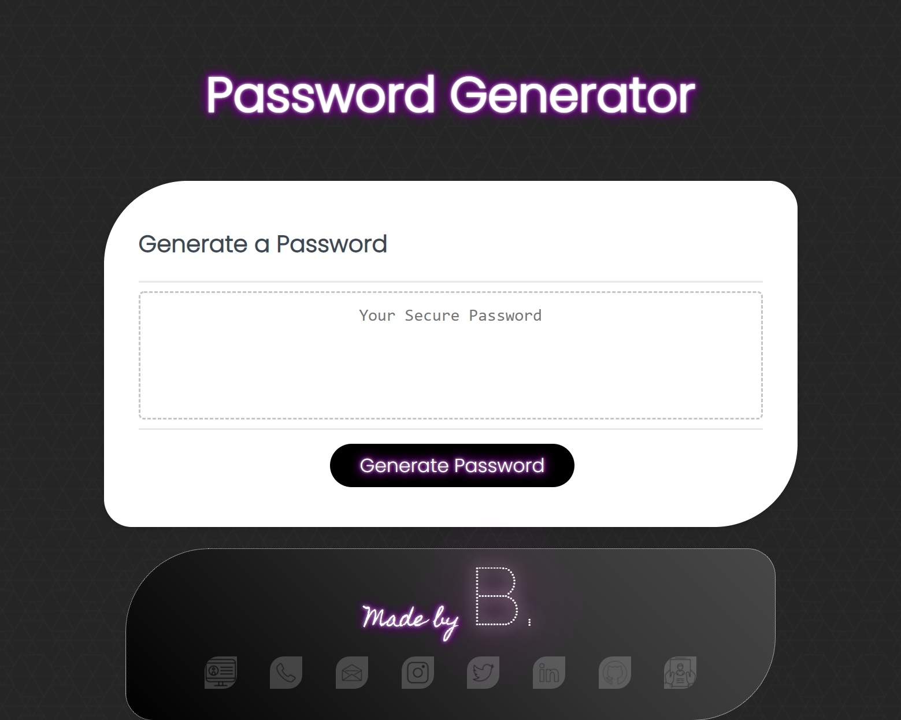
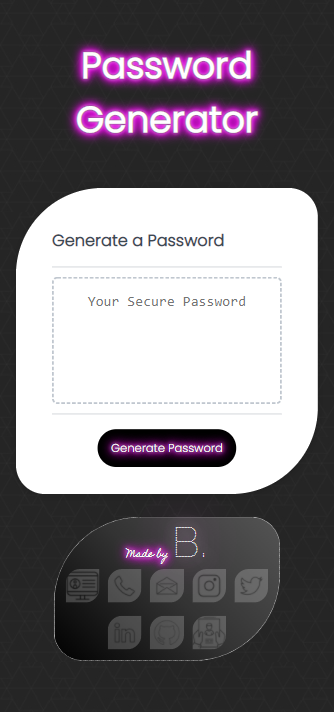
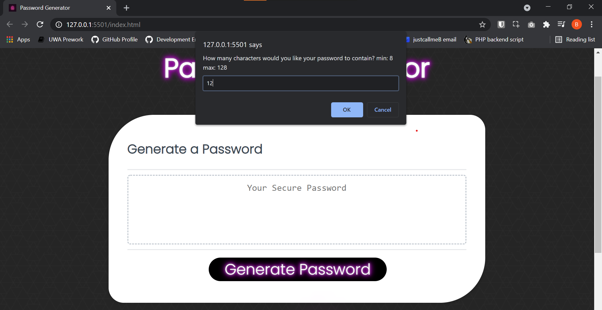
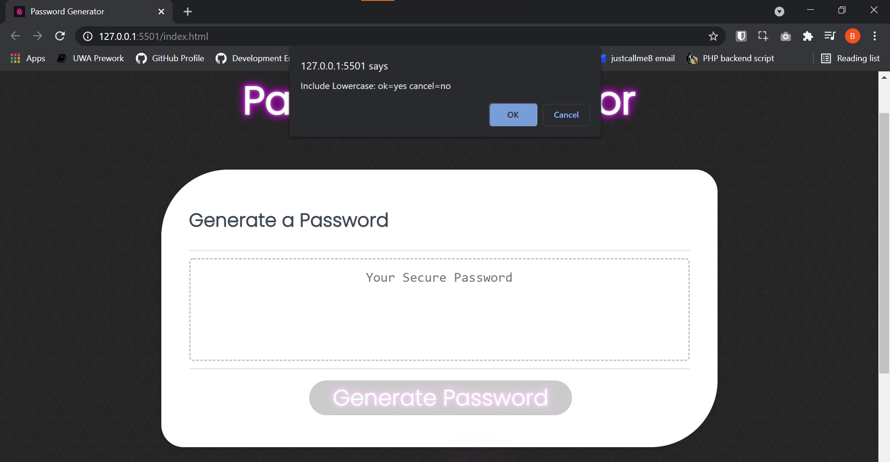
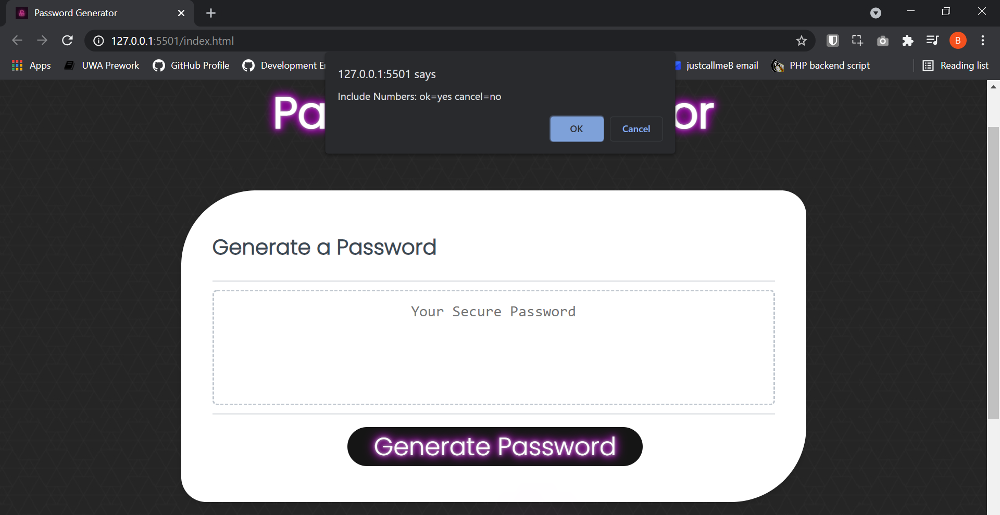
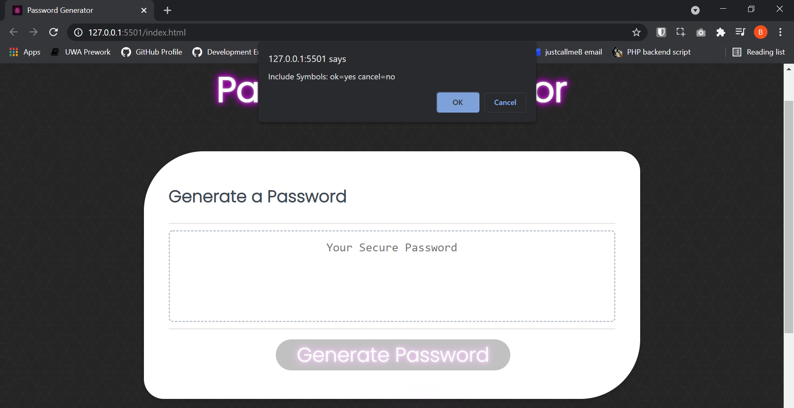
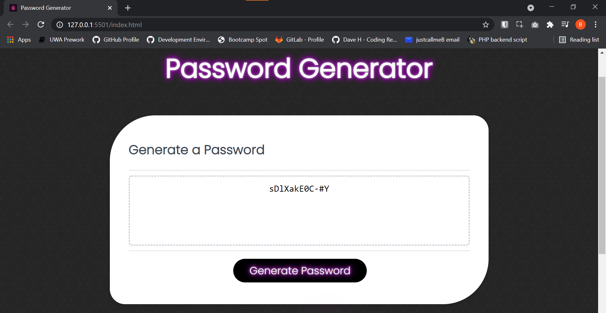

# Password Generator 

## This Github repository contains a secure password generator application written in HTML, CSS and JavaScript. 

It consists of a simple website which generates a complex password based on criteria supplied by the user when they click the generate password button.  

The user is prompted for the number of characters they wish their password to be, followed by a number of prompts as to whether their password should consist of Uppercase, Lowercase, Symbols and Numbers with OK and Cancel acting as a Yes or No prompt for each of these options. Once all questions have been asked of the user, the password is generated and supplied to the user in the website user interface, ready for use.

I was motivated to develop this website to begin to familiarise myself with Javascript as a programming language, and to combine it with my existing HTML and CSS skills.  The website UI was forked from an existing GitHub project but the JavaScript code and its use within the HTML and CSS is my own work. A password generator is a useful utility with real world application.

I aim to continue to iterate on the code in the future, potentially looking to better style the dialog boxes that are presented to the user, to move away from OK and Cancel to a Yes or No Prompt, and to simplify the multiple prompts provided to a single screen that allows the user to choose the various options they wish to supply as to the complexity of the password they wish to generate. Utilising JS code to automatically copy the generated password to the users clipboard could be another opportunity to improve the functionality of the project.

As this was my first real use of JavaScript within a web application I found the project challenging, but utilised a number of tutorials on the use of ASCII code pages to supply the usable characters I could utilise to generate  a compliant password. I also utilised my developer peers to sanity check and discuss my approach, utilising their knowledge and support to produce an acceptable end result. Finally, the use of dialog box prompting to provide the user with the ability to supply an answer to each question allowed me to meet my requirements and deliver a functional password generator.

Relying on the ```Math.random()``` function creates a bias in which values will be generated and subsequently used to form the string that is given as the generated password. Because of this we can expect to see that certain values will be favoured over others. As such there is a chance that, should all criteria be selected for a shorter password length, not all criteria may be present in the generated password. I have tried to reduce this possibility as much as possible by trying to insert a character from each of the selected criteria into the generated password.

<div align="center">

**Thank you for visiting.**

</div>

### Repository Link:

* https://github.com/blmccavanagh/Password-Generator/

### Deployed Application Link:

* https://blmccavanagh.github.io/Password-Generator/

### Application Screenshots:

---

<div align="center">

*Desktop Browser View* 

</div>



---

<div align="center">

*Mobile Browser View*

</div>



---

<div align="center">

*Generator Button Demo*

</div>


---

<div align="center">

*Password Length Prompt*

</div>



---

<div align="center">

*Password Lowercase Prompt*

</div>


---

<div align="center">

*Password Uppercase Prompt*

</div>



---

<div align="center">

*Password Numbers Prompt*

</div>



---

<div align="center">

*Password Symbols Prompt*

</div>



---

<div align="center">

*Example of Generated Password*

</div>



---